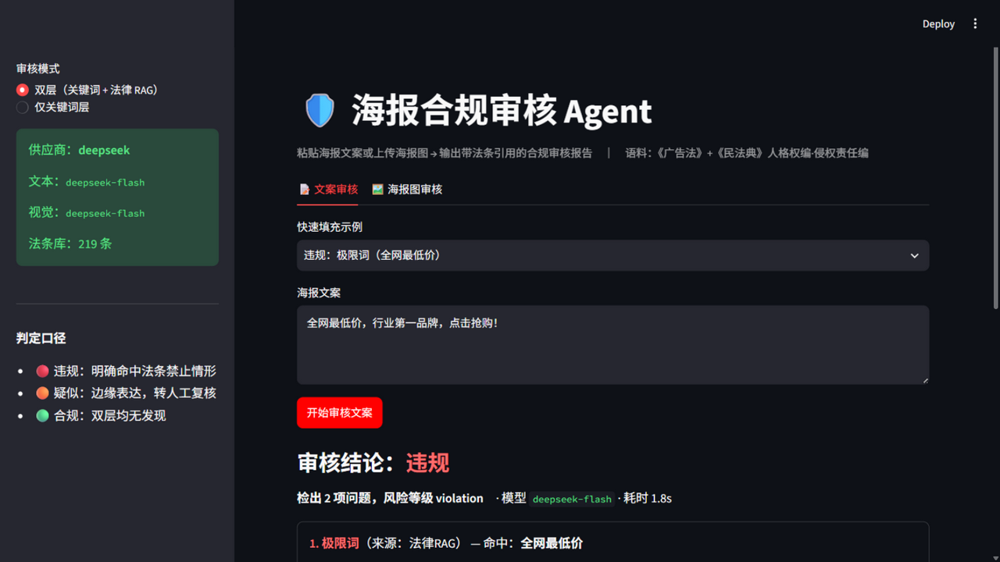
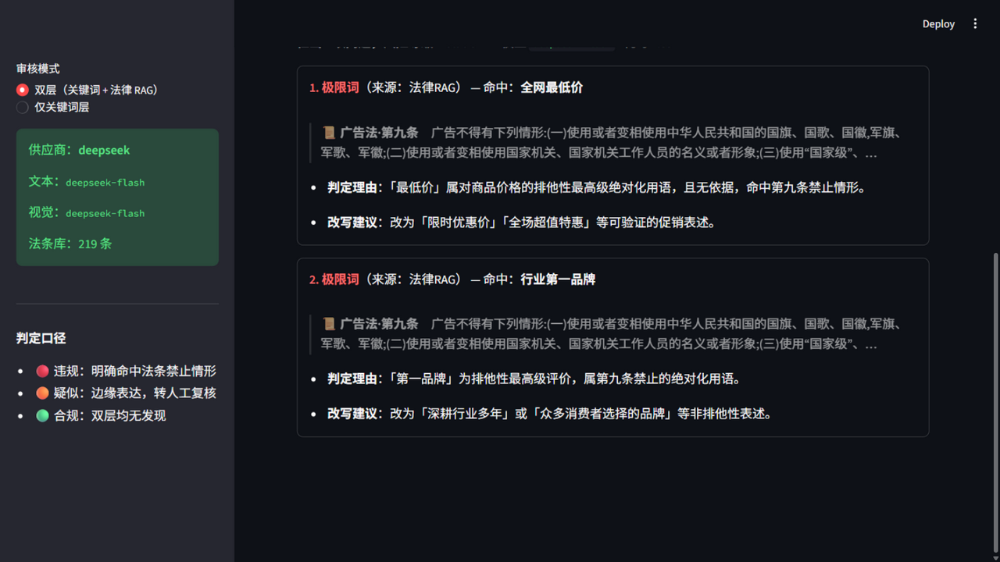
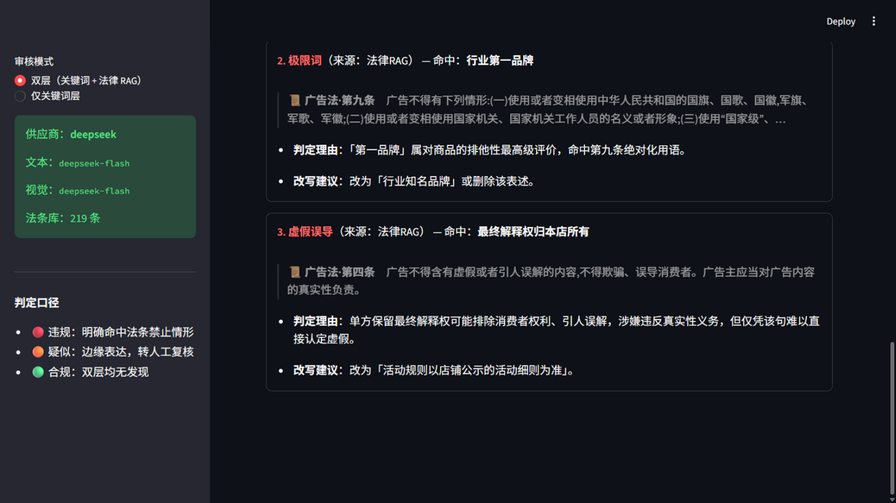
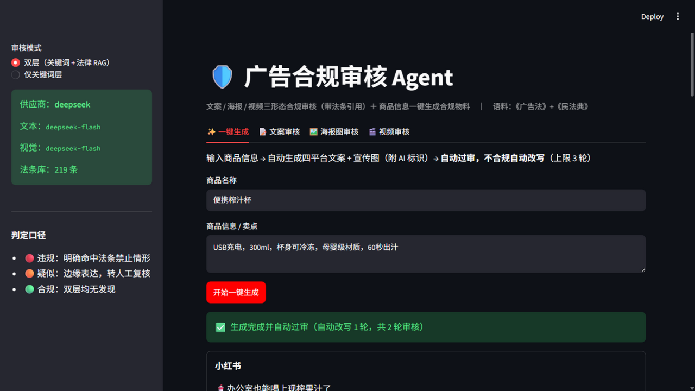
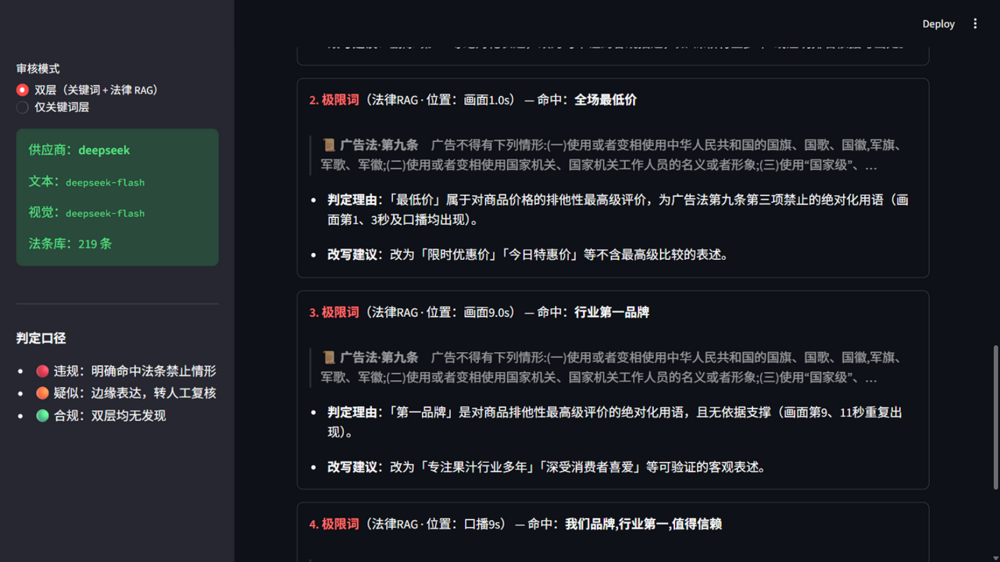

# 广告合规审核 Agent（广告宣传 Agent）

> **粘贴文案 / 上传海报 / 上传视频 → 带法条引用的合规审核报告；商品信息一键生成合规物料（不合规自动改写）**
> 语料：《广告法》全文 +《民法典》人格权编·侵权责任编（RAG，引用溯源到条号）
> 个人项目 · AIGC 方向 ｜ 一期（审核）+ 二期（生成闭环）均已完成

## 部署到 Vercel

仓库包含两个入口：`server.py` 是 Vercel / FastAPI 在线版，`app/app.py` 是本地 Streamlit 完整版。`pyproject.toml` 已显式指定 `server:app`，解决 Vercel 误把 Streamlit 页面当作 Python Web 入口的问题。

1. 导入此 GitHub 仓库，或打开已有 Vercel 项目。
2. 在 **Settings → Build and Deployment** 中，Framework Preset 选择 **FastAPI**，Root Directory 使用仓库根目录（留空），关闭此前手填的 Build Command、Install Command、Output Directory 覆盖，使用默认值。
3. 在 **Settings → Environment Variables** 添加 `LLM_PROVIDER` 和对应供应商的 `*_API_KEY`；模型名称与接口地址可按 `.env.example` 设置。密钥只放在 Vercel 环境变量，不提交到 GitHub。选择 Production 环境；需要预览版本时也选择 Preview。
4. 使用最新 `main` 分支重新部署；若首次修复后未自动触发，可在 Deployments 中重新部署。

例如使用智谱时设置 `LLM_PROVIDER=zhipu`、`ZHIPU_API_KEY`、`ZHIPU_TEXT_MODEL`、`ZHIPU_VISION_MODEL`；生图额外设置 `ZHIPU_IMAGE_MODEL`。模型名称与权限以你自己的供应商账户为准。也支持 DeepSeek 与百炼的 OpenAI 兼容接口，海报审核要求所选视觉模型支持图片输入。

可设置 `DEMO_ACCESS_TOKEN` 为一个自行选择的访问口令；设置后页面会出现口令输入框，模型接口需要该口令。没有配置 API Key 时，页面仍能打开，并可体验关键词初筛；其他功能会提示完成服务配置。

在线版保留文案审核、海报审核、多平台文案生成与宣传场景图生成。检索使用 **中文二元词 BM25 + 关键词法条映射**，不安装 Torch / BGE / FAISS；本地完整版仍使用 BGE 向量检索。下面的评测数字来自本地完整版，**不能直接当作在线版准确率**。在线版一次最多审核 / 改写两轮，疑似风险和未消除的违规风险明确交给人工；宣传图通过单独请求生成。

视频审核保留在本地完整版。在线版图片上限为 3 MB，临时文件写入系统临时目录并在请求结束后清理；生成图直接返回浏览器，不依赖云端磁盘长期保存。Windows FFmpeg、本地模型、评测素材等由部署配置排除。

本地运行在线版：

```powershell
pip install -r requirements.txt
python -m uvicorn server:app --reload --port 8000
# 打开 http://localhost:8000
```

部署配置依据：[Vercel FastAPI 文档](https://vercel.com/docs/frameworks/backend/fastapi)、[Python 入口与依赖](https://vercel.com/docs/functions/runtimes/python)。

## 演示截图

| | |
|---|---|
|  |  |
|  |  |
|  | |

## 核心能力

### 三形态合规审核
- **文案**：粘贴文本，关键词层 + 法律 RAG 语义层双层判定
- **海报图片**：VL 转写画面文字与元素，文字复用文案通道，视觉风险（肖像权/夸大误导）独立判定
- **视频**：抽帧走图片通道 + 语音 whisper 转写走文案通道，**违规定位到时间戳**（画面 1.0s / 口播 9s）

### 一键生成（生成 × 审核闭环）
商品信息 → 四平台文案（小红书/抖音口播/淘宝主图/朋友圈）+ 宣传图（附 AI 生成标识）
→ 自动过一期审核引擎 → 不合规带法条改写 → 循环收敛（上限 3 轮，疑似项转人工）。

### 架构

```mermaid
graph LR
    subgraph 输入
        A[文案] ; B[海报图] ; C[视频] ; D[商品信息]
    end
    subgraph 审核引擎（一期）
        K[关键词层<br>206词库] ; R[法律RAG语义层<br>BGE+FAISS 219条] ; V[VL视觉判定]
        K --> M ; R --> M ; V --> M
        M[合并去重<br>schema v1.1 报告]
    end
    subgraph 生成闭环（二期）
        G[copywriter<br>4平台文案] ; P[art_director<br>宣传图+AI标识] ; L[loop<br>生成×审核×改写 ≤3轮]
        D --> G ; G --> L ; P --> L ; L -->|不合规+法条改写指令| G
    end
    A --> K ; A --> R ; B --> V ; C --> K ; C --> R ; C --> V
    M --> O[Streamlit 报告<br>风险等级/法条引用/改写建议]
    L --> O
```

## 关键数据

| 指标 | 文案·有RAG | 文案·无RAG（消融） | 海报图 | 视频 |
|---|---|---|---|---|
| 违规拦截率 | **100%** (16/16) | 100% | **100%** (5/5) | 100% |
| 合规误报率 | **0%** (0/16) | 12.5% | **0%** (0/12) | — |
| 法条引用准确率 | 76.92% | 45.65% | 80.0% | — |
| 转写完整率（合成真值） | — | — | 100% (23/23) | 100% |

- **消融**：撤掉 RAG，误报 0%→12.5%、引用准确率 76.92%→45.65% 且无法溯源——法条知识库真实有效
- **混合检索必要性**：纯向量命中率仅 41.67%（口语「全网最低价」↔ 法条「最高级」语义鸿沟），关键词层「预期法条」并入候选是拦截率的关键
- **闭环收敛**：违规卖点商品首轮检出 3 项违规 → 自动带法条改写 1 轮 → 合规；正常商品 0 改写零误伤
- **视频定位**：3/3 findings 标到「画面 X 秒 / 口播 X 秒」，全链路 43s

## 本地完整版快速开始

```bash
python -m venv .venv
.venv\Scripts\Activate.ps1    # Windows PowerShell
pip install -r requirements-local.txt
Copy-Item .env.example .env
# 编辑 .env，填写自己供应商的 API Key。
# LLM_PROVIDER 可选 deepseek | zhipu | dashscope，模型名称也在 .env 中配置。

python -m streamlit run app/app.py    # 打开 http://localhost:8501
python eval/run_eval.py               # 复现评估指标（需 API Key）
```

视频语音转写使用 `faster-whisper`，首次运行会下载模型；Windows 所需的 FFmpeg / FFprobe 已放在 `tools/`。本地模型缓存、API Key 和用户上传文件不会随仓库发布。

海报评测原图仅保存在本地，仓库包含标注与合成脚本，因此新克隆的仓库不能直接通过完整图片评测集自检。可用 `python eval/make_synthetic_posters.py` 生成合成样本；完整评测需要另行准备标注对应的原图。

## 目录结构

```
engine/
  keyword_layer.py    关键词层：归一化 + 语境白名单 + 分类词库
  rag_layer.py        语义层：BGE+FAISS 混合检索 + LLM 逐条判断 + 标签归一
  image_channel.py    图片通道：VL 转写 + 视觉合规判定
  video_channel.py    视频原语：ffprobe 时长 / ffmpeg 抽帧 / whisper 转写
  copywriter.py       策划→文案两角色，4 平台 few-shot 生成
  art_director.py     配图提示词 → 生图 → AI 显式标识角标
  loop.py             生成×审核×改写闭环（上限3轮，违规级收敛判据）
  pipeline.py         双通道合并 + schema v1.1 校验
  llm_client.py       统一多供应商客户端（切模型只改 .env）
data/
  laws/               广告法74条 + 民法典两编145条（法名/条号/条文/场景备注）+ 向量库
  banned_words.txt    违禁词库 206 词（8 类）
  eval_cases.jsonl    文案评测集 40 条（16 违规/8 疑似/16 合规，带法条标注）
  eval_images/        海报评测集 22 张 + 标注（图不入库，标注入库）
eval/                 评估与构建脚本（run_eval / check_copy / selfcheck_* / build_laws …）
app/app.py            Streamlit 四 Tab Demo
docs/                 schema 定稿文档 + 演示截图
tools/                ffmpeg 静态包 / TTS 脚本
```

## 工程要点（真实踩坑）

- **语义鸿沟**：纯向量检索命中率仅 41.67%——「全网最低价」检不出第九条「最高级」。解法：词库每类词自带「预期法条」，关键词命中直接把法条并入 RAG 候选集（混合检索）
- **faiss / ffmpeg / System.Speech 均不支持中文路径**：统一经 ASCII 临时目录中转
- **ffmpeg 抽帧时序错位**：`-ss` 输入寻帧吸附稀疏关键帧（5 秒处抽出第 3 张幻灯片），改输出寻帧；音频长于视频时容器时长 ≠ 视频流时长，抽帧会越过末端静默失败——探测视频流时长
- **生成标签规范化**：模型输出「贬损竞品」不在八类枚举，别名归一表三处接入
- **闭环收敛判据**：疑似级按设计转人工，不作为循环条件（否则与过度谨慎的判审层互相打地鼠）；以「无违规级发现」为收敛

## 排期与进度

一期（审核，第 1~2 周）：✅ 全部完成。二期（生成闭环 + 视频审核，第 3~4 周）：✅ 全部完成。
